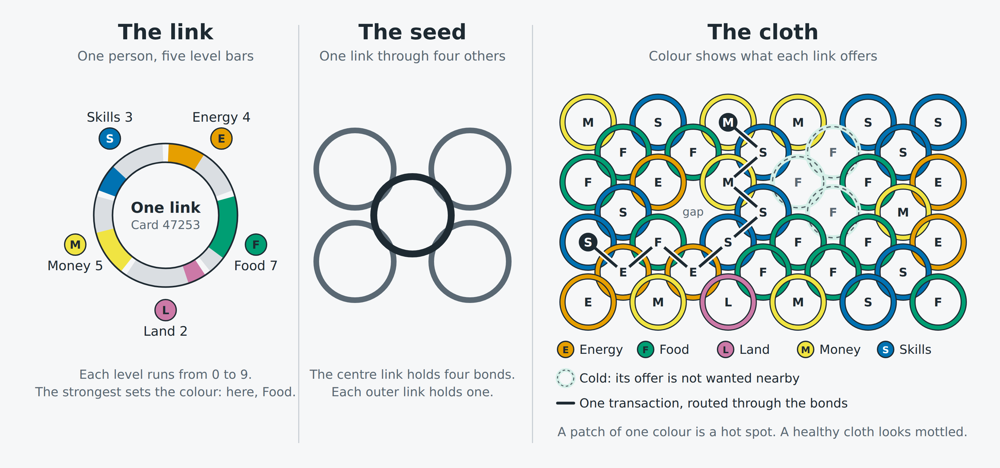

# Chainmail Economics

Chainmail Economics pictures an economy built from individuals instead of institutions, where people are links in a chainmail of interlocking rings. It starts from one question: how can a community reduce its dependence on outside companies and governments?

The model is simple enough to teach in one lesson, and it comes with a classroom game that ends in real trading with bitcoin.

## What's here

| File | What it is |
| --- | --- |
| `chainmail-economics.md` | The model and the rules of the game. Start here to understand it. |
| [`chainmail-diagram.png`](chainmail-diagram.png) | The model in three views: the link, the seed, and the cloth. |
| `index.html` | The facilitator's landing page. Start here to run a session. |
| `chainmail-game.html` | The game board, run by a facilitator on one large screen. |
| `chainmail-card.html` | The participant's card and trading screen, made for a phone. |

The three HTML files are standalone. They load nothing from outside and need no build step.

## The model in brief

- Each person is one link, with five attributes: energy, food, land, money, and skills (E, F, L, M, S).
- Each link bonds with up to four others, as in the four-in-one weave of real chainmail. There are no hubs.
- A link's levels are advice. The decision to bond belongs to the holders of the links involved.
- Value is counted in sats. There is no debt, and gifting is an economic act.
- A heat map shows what each link offers and how much that offer is wanted where it sits.

## What you need

- One spring-gate clip ring for each participant.
- A large screen for the board, with sound for the bell.
- Dice. One between a few participants is enough.
- A phone for each participant.
- For the trading part: an internet connection, and one Blitz Wallet gift code of 600 sats for each participant, printed or handed over privately. Each code is cash, so it must not be shown on the big screen.

## What the game is about

No one wins this game alone. It has three aims, in order:

1. **Build a good cloth.** Get enough participants linked to make one.
2. **Reach Enough.** Trade until as many links as possible have what they need.
3. **Stay in.** Still be bonded in the cloth at the closing bell.

## Running a session

The facilitator runs the board and keeps the game moving. Every choice belongs to the participants.

### 1. Build the cloth

A card is loaded in three steps, each done by hand:

1. **Roll.** The participant rolls a dice four times, once each for energy, food, land, and skills.
2. **Set.** They open the card on their phone, choose a username (an anonymous one is fine), and set each slider to the number rolled, from 1 to 6. Money cannot be set. It comes later.
3. **Send.** They show, say, or send their five-digit number to the facilitator, who enters it in the game.

The first link goes to the centre of the board. Each later link asks for a place, and each neighbour accepts or denies. One acceptance is enough to join.

A link's colour and letter show its strongest attribute. The strength of the colour shows how wanted that offer is among its bonded neighbours:

| Strength | Neighbours' average | Shown as |
| --- | --- | --- |
| Wanted | Below about 2.7 | Full colour |
| Neutral | About 2.7 to 4.3 | Normal colour |
| Cold | Above about 4.3 | Pale colour, dashed outline |

### 2. The gift

When everyone is on the board, nobody has any money. The facilitator presses **Gift money to everyone**, and every link receives 6 units of money, which is 600 sats.

The facilitator then presses **Lightning wallet**. Slides open full screen and walk the class through scanning their gift code, installing Blitz Wallet, and accepting the gift. From then on each participant holds their own sats.

On their phone, each participant presses **Open trading**. The card becomes a trading screen showing their sats, their levels, and what they need.

### 3. Trade

The aim for each participant is to reach **enough**, which is 3 or more in energy, food, land, and skills. The aim for the class is for as many links as possible to get there. Anything above 3 is spare, and is better traded away than kept.

- **One unit at a time.** The opening price is 100 sats. After that, the price is whatever the two links agree.
- **The buyer asks.** The seller accepts or denies. The buyer pays from wallet to wallet.
- **One purchase per round** for each link.
- **Every trade needs a bonded route.** In the first trading round a trade can cross one bond, in the second up to two, and after that any number within a cloth.

The first two trades are best run one at a time on the board, using **Trade a unit**, so the class sees how it works. Then the market opens:

1. The facilitator chooses a trading time and rings the opening bell. A countdown runs on the board.
2. Participants find each other, agree trades, and pay.
3. The buyer records each purchase on their trading screen, which builds a trade line. They pay in their wallet with that line as the message, then send the same line to the facilitator. The seller records the sale on their own screen to keep their levels right.
4. When the closing bell rings, the facilitator enters the lines and the board updates.

A trade line has four parts: buyer, seller, attribute, price.

`F6 D5 F 120` means F6 bought one unit of food from D5 for 120 sats.

The trading screen and the wallet are kept separate on purpose. The wallet is the ledger of the game. Its history shows the amount, the time, and the message of every payment, and the message is the trade line. The trading screen and the board are working copies. If they disagree with the wallet history, the wallet settles it and the board is corrected to match.

Lines can be typed or pasted, one or many at a time. A line that fails a check stays in the box with the reason beside it.

The board shows the average price of each attribute, and how many links have enough.

### 4. Later rounds

Between markets the facilitator can start the next round, break a bond for a participant, record a pair that now accepts each other, trigger a shock, undo the last action, and save the game to a file.

A shock strips a random link of its bonds and sets it down alone in a free place. A link that breaks its own last bond is set down the same way. A link left with no bonds by either event stays where it is, shows a small arrow mark, and may ask once for a new place in the next round.

### 5. The closing bell and the debrief

The game runs on the countdown timer. The closing bell ends the active part of the game. Links bonded in the cloth at that moment have stayed in. A link with no bonds is still in the game. It cannot trade, but a new arrival can bond with it and start a new seed.

After the bell, leave the board on screen and hold a debrief. The game ends when the facilitator presses **Start a new game**, which resets the board. Questions to start with:

- Who kept their sats, and why?
- Did prices stay at 100 sats? Which attribute cost most?
- Did the class end with one cloth or several, and is that healthy?
- Who gave something away?

## Sharing the card

The landing page and the card need to be opened from a web address for the QR code and the WhatsApp buttons to work. If GitHub Pages is enabled for this repository, the landing page is at:

`https://blankworker1.github.io/chainmail-economics/`

The landing page builds the QR code for the card. If the facilitator enters their WhatsApp number there, the code and link change so that cards and trade lines arrive as direct messages. The link then takes this form:

`chainmail-card.html?to=447700900123`

The number is part of the link, so participants can see it.

## Status

The model is a theoretical visualisation of self-coordinated behaviour. The game is a first version. It has been tested by simulated play and has not yet been run with a real class.

Planned next:

- A version that runs offline from a Raspberry Pi hotspot, with cards and trades sent straight to the game.
- The extension of the model to community and regional scale.

### Tasks

Blitz Wallet testing, before the first session:

- [ ] Send a test payment between two phones with a trade line as the message.
- [ ] Check that the wallet history on both phones shows the amount, the time, and the message.
- [ ] Check whether the message is typed by the buyer or set by the seller's payment request.
- [ ] Claim a 600 sats gift code on a phone with a fresh install.
- [ ] Check the eight wallet slides against the current app screens.

## Credits

`index.html` embeds the QR Code Generator for JavaScript by Kazuhiko Arase, used under the MIT licence.

## Licence

No licence has been chosen yet.
